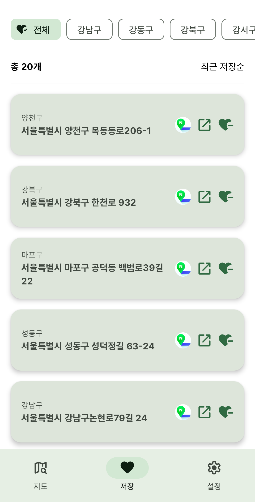

# 여기있수거

## 📌 앱 소개

**여기있수거**는 서울시 대부분 지역(도봉구, 용산구 제외)에 위치한 의류수거함을 쉽게 찾아보고 북마크할 수 있는 앱입니다.
사용자는 지도를 통해 주변 의류수거함 위치를 확인하고, 북마크 기능을 활용하여 자주 이용하는 수거함을 저장할 수 있습니다.

## 🔗 다운로드

📥앱 다운로드 링크: [여기있수거 - Google Play Store](https://play.google.com/store/apps/details?id=com.yogiissugeo.android)  *(현재 비공개 테스트 진행 중)*

---
## 🌍 서비스 지역

현재 여기있수거는 공공 데이터가 제공되지 않는 **도봉구와 용산구**를 제외한 서울시 대부분 지역에서 서비스를 제공합니다.

---

## ⚙️ 사용한 기술

### 🏗 아키텍처 및 개발 도구

- **Android Studio**
- **Kotlin**
- **MVVM**
- **Clean Architecture**

### 🛠 라이브러리 및 프레임워크

- **Hilt** : 의존성 주입
- **Retrofit2** : 네트워크 통신
- **Coroutine, Flow** : 비동기 처리 및 UI 상태 관리
- **Jetpack Compose** : UI  구성
- **Room** : 의류수거함 데이터 로컬 저장 및 북마크 관리
- **Paging3** : 북마크 리스트 페이징 처리
- **Naver Map SDK** : 지도 및 위치 서비스, 클러스터링 기능
- **Firebase RemoteConfig** : 앱 설정 동적 관리, 강제업데이트 기능
- **Admob** : 광고 수익화
- **공공데이터API** : 의류수거함 정보 제공

---

## 📲 앱 사용 흐름

1. 앱을 실행하면 `지도` 탭이 표시됩니다.
2. 상단의 `구 선택` 스피너로 원하는 지역을 선택하면 해당 구의 의류수거함이 지도 위에 표시됩니다.
3. '더보기' 버튼을 눌러 추가 수거함을 로드할 수 있습니다.
4. 지도에서 마커를 클릭하면 해당 수거함을 북마크할 수 있습니다.
5. `저장` 탭에서 북마크한 수거함 목록을 확인하고, 구별 필터링이 가능합니다.
6. 저장된 수거함에서 다음 작업이 가능합니다.
   - 네이버 지도에서 위치 확인
   - 주소 텍스트 공유
   - 북마크 삭제
7. 저장된 카드를 클릭하면 `지도` 탭으로 이동하며, 수거함 위치를 바로 확인할 수 있습니다.
8. 북마크된 수거함은 지도에 별도로 표시됩니다.

---

## 📸 스크린샷

| 🌍 지도 |  🔍 수거함 위치 확인 | ❤️ 북마크 추가 | 📋 북마크 목록 | 
| ---- | -------- | ----- | ----- |
|||||

---

## 🚀 향후 추가 예정 기능

- **의류수거함 상태 신고 기능**: 유저가 직접 수거함 상태를 신고할 수 있도록 추가 예정
- **위치 기반 추천 기능**: 현재 위치를 기준으로 가까운 의류수거함을 추천하는 기능

---

© 2025 여기있수거. All rights reserved.

